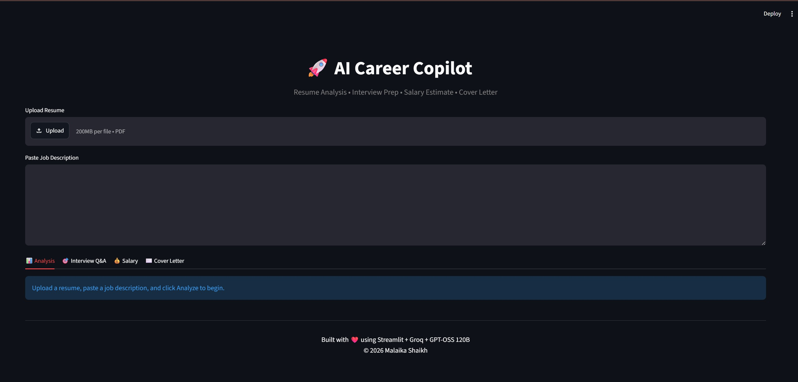
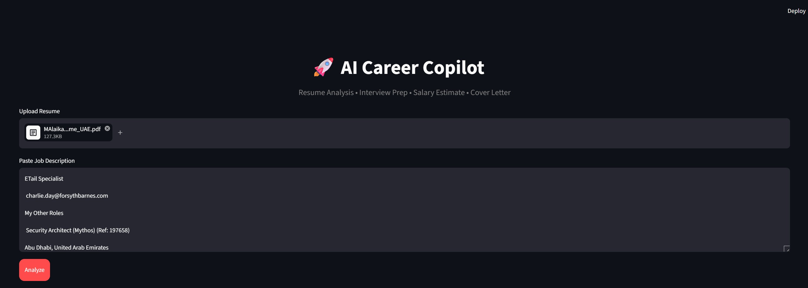
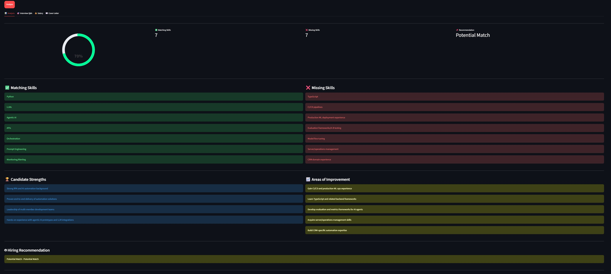
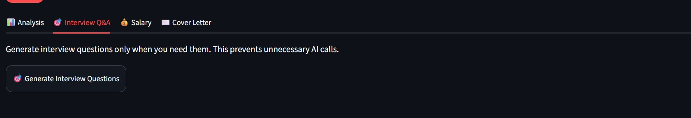
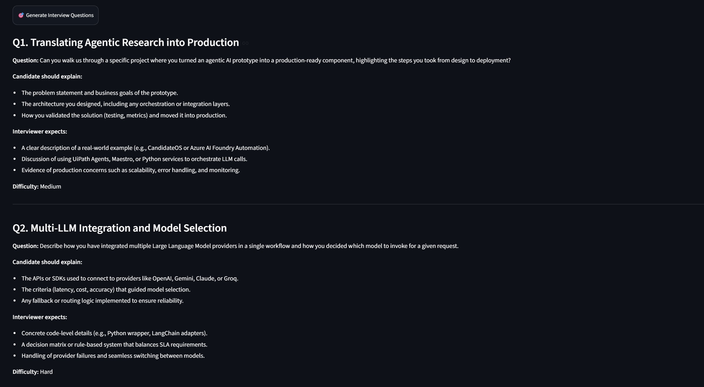
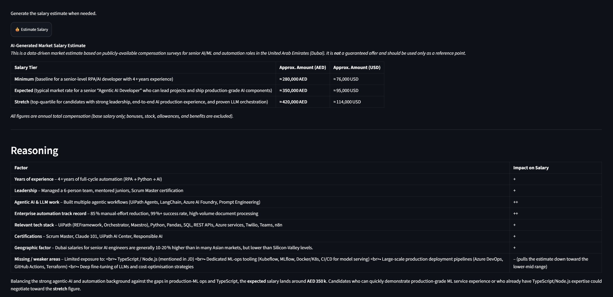
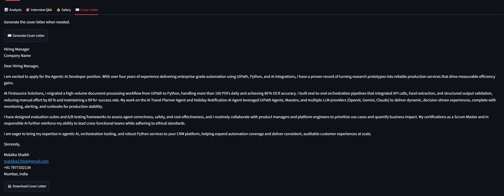

# 🚀 CandidateOS 2.0 — AI Career Copilot

CandidateOS 2.0 is an AI-powered career assistant that helps candidates evaluate job opportunities and prepare for applications using their resume and a target job description.

The application brings **resume analysis, ATS-style matching, interview preparation, salary estimation, and personalized cover-letter generation** together in one simple Streamlit application.

---

## ✨ What CandidateOS Does

CandidateOS follows a simple end-to-end career workflow:

**Upload Resume → Add Job Description → Analyze Match → Prepare for Interview → Estimate Salary → Generate Cover Letter**

AI-powered features are generated **on demand**, helping avoid unnecessary LLM/API calls.

---

# 🖥️ Application Walkthrough

## 1. 🏠 Main Application

The application starts with a clean interface where the candidate can upload their resume and enter the job description for the role they are targeting.

This provides the starting point for the complete CandidateOS workflow.



---

## 2. 📋 Add Job Description

The candidate pastes the target job description into CandidateOS.

The job description becomes the context used by the AI to evaluate how well the candidate's resume matches the requirements of the role.



---

## 3. 📊 ATS Resume Analysis

CandidateOS analyzes the uploaded resume against the target job description.

The analysis provides:

- AI-generated match score
- Matching skills
- Missing skills
- Candidate strengths
- Areas for improvement
- Hiring recommendation

This gives the candidate a quick understanding of how closely their profile aligns with the target position.



---

## 4. ⚡ On-Demand AI Generation

AI-heavy features are generated **only when the candidate requests them**.

Instead of automatically making multiple LLM calls when the application loads, CandidateOS allows the user to trigger features such as interview preparation, salary estimation, and cover-letter generation when needed.

This approach helps reduce unnecessary API usage and makes the application more efficient.



---

## 5. 🎯 Interview Q&A

CandidateOS generates role-specific interview questions using both the candidate's resume and the target job description.

Each question provides:

- **Interview Question**
- **Ideal Answer**
- **What the Interviewer Is Looking For**
- **Difficulty**

This makes the generated questions more relevant than generic interview questions because they are grounded in the candidate's experience and the requirements of the target role.



---

## 6. 💰 Salary Estimation

CandidateOS provides an AI-generated salary estimate based on the candidate's profile and the target position.

The output includes:

- Minimum Salary
- Expected Salary
- Stretch Salary
- Reasoning behind the estimate
- Factors affecting compensation

The estimate is intended as a market-oriented guide rather than a guaranteed compensation offer.



---

## 7. ✉️ Cover Letter Generator

CandidateOS generates a professional, ATS-friendly cover letter tailored to the candidate's resume and target job description.

The generated letter is formatted as a ready-to-use application document and can be downloaded directly as a `.txt` file.



---

# 🧠 How It Works

```text
              ┌───────────────────┐
              │   Upload Resume   │
              │       PDF         │
              └─────────┬─────────┘
                        │
                        ▼
              ┌───────────────────┐
              │  Add Job          │
              │  Description      │
              └─────────┬─────────┘
                        │
                        ▼
              ┌───────────────────┐
              │   ATS / AI        │
              │     Analysis      │
              └─────────┬─────────┘
                        │
                        ▼
              ┌───────────────────┐
              │ On-Demand AI      │
              │    Features       │
              └─────────┬─────────┘
                        │
          ┌─────────────┼──────────────┐
          ▼             ▼              ▼
      🎯 Interview   💰 Salary     ✉️ Cover
          Q&A        Estimate       Letter
```

---

# 🛠️ Tech Stack

- **Python**
- **Streamlit**
- **Groq API**
- **GPT-OSS / LLM models**
- **LangChain**
- **PyPDF**
- **Pandas**
- **JSON**
- **Regex**

---

# 🔐 Security

API credentials are stored using environment variables.

The `.env` file is excluded from Git version control using `.gitignore`.

**Never commit your actual API key to GitHub.**

---

# 🚀 Run Locally

### 1. Clone the repository

```bash
git clone https://github.com/MalaikaSk/AI-Resume-Screening-Agent.git
cd AI-Resume-Screening-Agent
```

### 2. Install dependencies

```bash
pip install -r requirements.txt
```

### 3. Configure the Groq API key

Create a `.env` file in the project root:

```env
GROQ_API_KEY=your_groq_api_key_here
```

### 4. Start the application

```bash
streamlit run app.py
```

The application will open in your browser.

---

# 📁 Project Structure

```text
CandidateOS_2.0/
│
├── .devcontainer/
│   └── devcontainer.json
│
├── screenshots/
│   ├── main_page.jpg
│   ├── add_JD.jpg
│   ├── ATS_score.jpg
│   ├── on_demand.jpg
│   ├── interview_questions.jpg
│   ├── generate_salary.jpg
│   └── cover_letter.jpg
│
├── .env
├── .gitignore
├── AI Engineer JD_sample.txt
├── app.py
├── requirements.txt
├── testGemini.py
├── testGroq.py
└── README.md
```

---

# 🎯 Project Goal

CandidateOS was built to demonstrate a practical application of **Large Language Models in recruitment and career workflows**.

Rather than functioning as a generic chatbot, the application focuses on a complete candidate journey:

**Resume → Job Matching → Interview Preparation → Salary Estimation → Cover Letter**

The goal is to make AI useful throughout the job-application process while keeping the experience simple and user-driven.

---

# 🔮 Future Improvements

Potential future enhancements include:

- Resume improvement suggestions
- Multiple resume comparison
- Job-description parsing
- Interview answer evaluation
- LinkedIn profile analysis
- Application tracking
- Additional LLM providers
- User authentication
- Persistent candidate profiles

---

# 👩‍💻 Author

**Malaika Shaikh**

AI / Automation Engineer

Built with ❤️ using **Python, Streamlit, LangChain and Groq**.

---

## ⭐ Feedback

If you find CandidateOS useful, feel free to explore the repository and share feedback.